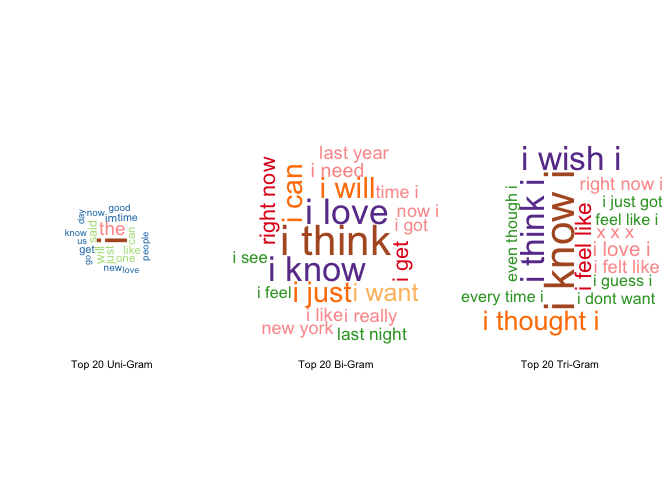

# PREDICTIVE TEXT ANALYTICS - Milestone Report
Sabank  
April 30, 2016  

### Synopsis:
In this [Capstone project](https://www.coursera.org/learn/data-science-project/) from the Coursera Data Science Specialization, [Johns Hopkins University](https://www.jhu.edu/) is partnering with [SwiftKey](http://swiftkey.com/en/) to apply data science in the area of natural language processing.
The goal of this milestone report is just to display that we've gotten used to working with the data and that we are on track to create our prediction algorithm. It specifically addresses the exploratory analysis and identifies the major features of the data.

### Findings:
 1. Processing is computer-resources and time consuming because of the huge file size of the dataset. Sampling is then a requirement to avoid endless runtimes of the code (especially with small RAM capacity available). For instance, this exploratory analysis has used 0.2% of the population of each file to hardly run smoothly on a computer of 4GB of RAM. The very small size of the sample necessarily impacts the accuracy for the subsequent predictions.
 2. The text mining process will need to be fine-tuned, although results are satisfying upon this sample. As seen in the top 20 n-gram plots, some strategy will need to be implemented to capture inconsistencies such as unigram "im" or trigram "xxx."

###1. DATA ACQUISITION
The HC Corpora [data](https://d396qusza40orc.cloudfront.net/dsscapstone/dataset/Coursera-SwiftKey.zip) give access to 4 different languages. However, analytical processes have been performed on English files only:

 * en_US.blogs.txt
 * en_US.news.txt
 * en_US.twitter.txt.

```r
# download url zip file
fileURL <- "http://d396qusza40orc.cloudfront.net/dsscapstone/dataset/Coursera-SwiftKey.zip"
download.file(fileURL, destfile = "./Coursera-SwiftKey.zip", method = "curl")
unlink(fileURL)
unzip("./Coursera-SwiftKey.zip")
```


This file was last downloaded 2016-05-01


```r
# acquire English files
blogs <- "./final/en_US/en_US.blogs.txt"
news <- "./final/en_US/en_US.news.txt"
twitter <- "./final/en_US/en_US.twitter.txt"
```

### 2. DATA PROCESSING
### 2.1 R libraries
Some of libraries required for this exploratory analysis.

```r
library(stringi)
library(tm);library(RWeka)
# library(ggplot2)
library(wordcloud)
```

### 2.2 Data characteritics

```r
# read files
r_blogs <- readLines(blogs, encoding = "UTF-8", skipNul=TRUE)
r_news <- readLines(news, encoding = "UTF-8", skipNul=TRUE)
r_twitter <- readLines(twitter, encoding = "UTF-8", skipNul=TRUE)
# file size
s_blogs <- utils:::format.object_size(file.info(blogs)$size,"auto")
s_news <- utils:::format.object_size(file.info(news)$size,"auto")
s_twitter <- utils:::format.object_size(file.info(twitter)$size,"auto")
# line count
l_blogs <- length(r_blogs)
l_news <- length(r_news)
l_twitter <- length(r_twitter)
# word count
w_blogs <- sum(stri_count_words(r_blogs))
w_news <- sum(stri_count_words(r_news))
w_twitter <- sum(stri_count_words(r_twitter))
# summary
filesummary <- data.frame(FileName = c("Blogs","News","Twitter"),
                          FileSize = c(s_blogs,s_news,s_twitter),
                          LineCount = c(l_blogs,l_news,l_twitter),
                          WordCount = c(w_blogs,w_news,w_twitter))
colnames(filesummary) <- c(" File Name "," File Size "," Total Line "," Total Word ")
filesummary
```

```
##    File Name   File Size   Total Line   Total Word 
## 1       Blogs    200.4 Mb       899288     37546246
## 2        News    196.3 Mb      1010242     34762395
## 3     Twitter    159.4 Mb      2360148     30093410
```

### 2.3 Exploratory analysis
Considering the above dataset characteristics, each file is sampled for 0.2% in order to enable faster processing.

```r
# set seed for reproducibility
set.seed(987)
# sampling
sp_blogs <- sample(r_blogs,l_blogs * 0.002)
sp_news <- sample(r_news,l_news * 0.002)
sp_twitter <- sample(r_twitter,l_twitter * 0.002)
sp_data <- c(sp_blogs,sp_news,sp_twitter)
```
Building a clean text corpus.

```r
# text mining
# remove all inconsistent characters, URL, punctuation, numbers, etc.
sp_dataclean <- VCorpus(VectorSource(sp_data))
sp_dataclean <- tm_map(sp_dataclean,content_transformer(function(x) iconv(x,to="UTF-8",sub="byte")),mc.cores=2)
sp_dataclean <- tm_map(sp_dataclean,removeWords,stopwords("english"))
sp_dataclean <- tm_map(sp_dataclean,content_transformer(tolower),lazy=TRUE)
sp_dataclean <- tm_map(sp_dataclean,stripWhitespace)
removeURL <- function(x) gsub("http[[:alnum:]]*","",x)
sp_dataclean <- tm_map(sp_dataclean,content_transformer(removeURL))
sp_dataclean <- tm_map(sp_dataclean,content_transformer(removeNumbers))
sp_dataclean <- tm_map(sp_dataclean,content_transformer(removePunctuation),preserve_intra_word_dashes=TRUE)
sp_dataclean <- tm_map(sp_dataclean,PlainTextDocument)
sp_corpus <- data.frame(text=unlist(sapply(sp_dataclean,`[`,"content")),stringsAsFactors=FALSE)
```
Generating uni, bi and tri N-gram

```r
# tokenization
getNGram <- function(corpus, mingrams, maxgrams) {
    ngram <- NGramTokenizer(corpus, Weka_control(min=mingrams,max=maxgrams,delimiters=" \\r\\n\\t.,;:\"()?!"))
    ngram <- data.frame(table(ngram))
    ngram <- ngram[order(ngram$Freq,decreasing=TRUE),][1:20,]
    colnames(ngram) <- c("String","Count")
    ngram
}
# n-gram
uniGram <- getNGram(sp_corpus,1,1)
biGram  <- getNGram(sp_corpus,2,2)
triGram <- getNGram(sp_corpus,3,3)
```

### 3. RESULTS
### 3.1 Visualization

```r
# align 1x3 plots
par(mfrow = c(1,3))
# create wordcloud
createWC <- function(ngram,nlabel) {
     wordcloud(ngram$String, 
               ngram$Count,
               random.order=FALSE,
               rot.per=.25,
               use.r.layout=TRUE, 
               colors=brewer.pal(12,'Paired'))
     text(x=0.5,y=-0.1,nlabel)
}
# plots
createWC(uniGram,"Top 20 Uni-Gram")
createWC(biGram,"Top 20 Bi-Gram")
createWC(triGram,"Top 20 Tri-Gram")
```



### 3.2 Next step: building the prediction algorithm
Current plan for the development of the text prediction application:

 * improve text mining and tokenization of 1-gram by customizing the function "stopwords" to process the data
 * use 4-grams, 3-grams and 2-grams to estimate the most likely word to follow the entered text
 * train a prediction algorithm
 * build a Shinyapp allowing user input and displaying algorithm prediction

### Session information

```
##  sysname  release 
## "Darwin" "15.4.0"
```

```
## [1] "R version 3.1.2 (2014-10-31)"
```
