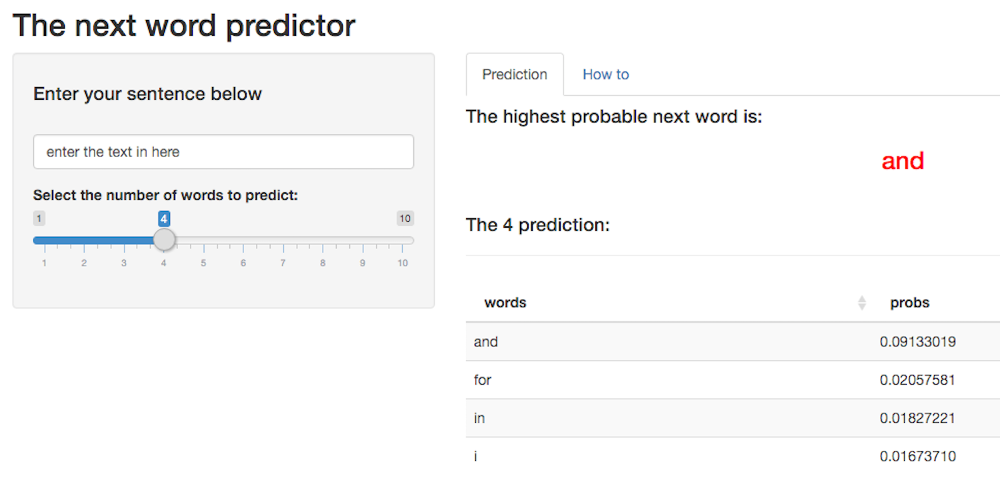

Introduction
========================================================

In the context of smart prediction technology, the basic purpose of this 'Capstone' course project is to create a product to highlight the prediction algorithm built and to provide an interface that can be accessed by others.

The Shiny App allows the user to explore Natural Language Processing and to test an implementation using a 5-gram model, with smoothing by discounting for low frequency words, based on the [Katz backoff strategy](https://en.wikipedia.org/wiki/Katz%27s_back-off_model).

In particular, the model takes the last few words of the phrase and uses statistics against a large Corpus, provided by [SwiftKey](https://swiftkey.com/en), to find the most probable next word.

The next word predictor app
========================================================

Launch the app [here](https://sabank.shinyapps.io/DSCapstone/)

Functionalities:

1. Enter a phrase (multiple words) in the input text box
2. Manipulate the slider to select the number of words to be predicted
3. Visualize the highest probable next word (in red) for your phrase and the remaining predicted words in the table below

    

Data
========================================================

Download the Corpus [here](https://d396qusza40orc.cloudfront.net/dsscapstone/dataset/Coursera-SwiftKey.zip)

The file was specifically processed for the needs of this project. The focus was to provide with:

-   Data cleaning/preprocessing
-   N-gram tokenization
-   Training and building of the prediction algorithm

Resources
========================================================

Coursera - JHU - [Data Science](https://www.coursera.org/specialization/jhudatascience/1?utm_medium=listingPage)

Coursera - Stanford - [Natural Language Processing](https://www.coursera.org/course/nlp)

- Martin, J. H., & Jurafsky, D. (2009). Speech and language processing. Pearson International Edition. ISBN 978-0135041963

- Katz, S. (1987). Estimation of probabilities from sparse data for the language model component of a speech recognizer. Acoustics, Speech and Signal Processing, IEEE Transactions on, 35(3), 400-401.

Shiny app deployment:
https://www.shinyapps.io/ 
